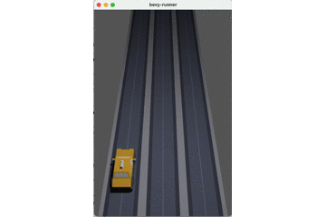
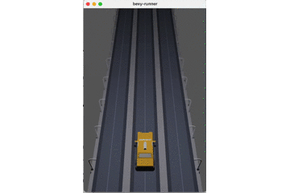
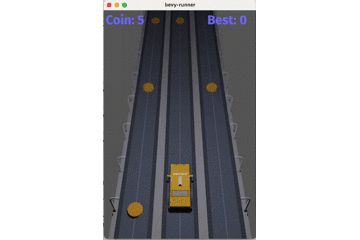
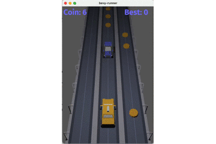
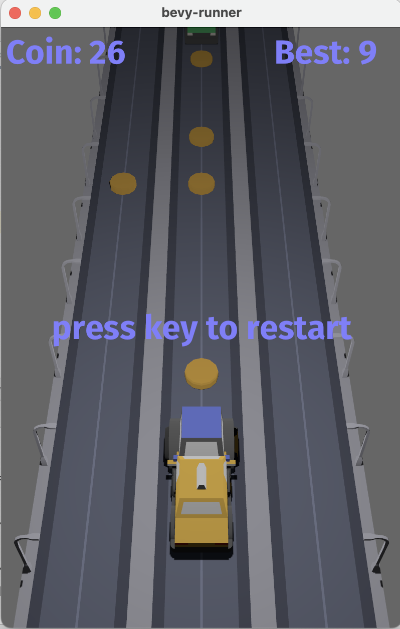

# bevy-runner - creating a 3D game with rust and bevy

My second 3D game with rust(https://www.rust-lang.org) and the bevy framework(https://bevyengine.org).

I am inspired by the classic endless runners like #TempleRun or #SonicDash but with cars.  
    
Thanks to Kenny https://www.kenney.nl for the assets.

## 1. Step _ load street and car

<br><br><br><br><br><br><br><br><br><br>


```Rust
//camera
    commands.spawn_bundle(PerspectiveCameraBundle{
        transform: Transform::from_xyz(1.0,6.0,3.0).looking_at(Vec3::new(1.,0.,-2.), Vec3::Y),
        ..Default::default()
    });

    // light
    commands.spawn_bundle(PointLightBundle{
        point_light: PointLight{
            intensity: 1500.0,
            shadows_enabled: true,
            ..Default::default()
        },
        transform: Transform::from_xyz(1.0, 4.0, 0.0),
        ..Default::default()
    });

    // street
    for j in -8..2 {
        for i in 0..3 {
            commands.spawn_bundle((
                Transform {
                    translation: Vec3::new(i as f32, 0.0, j as f32),
                    rotation: Quat::from_rotation_y(FRAC_PI_2),
                    ..Default::default()
                },
                GlobalTransform::identity(),
            ))
                .with_children(|parent| {
                    parent.spawn_scene(asset_server.load("models/road_straight.glb#Scene0"));
                });
        }
    }

    //player
    commands.spawn_bundle((
        Transform {
            translation: Vec3::new(1.0,0.0,0.0),
            scale: Vec3::new(0.4, 0.4, 0.4),
            ..Default::default()
        },
        GlobalTransform::identity(),
    ))
        .with_children(|parent| {
            parent.spawn_scene(asset_server.load("models/taxi.glb#Scene0"));
        })
        .insert(Player);
```

## 2. Step _ move car

<br><br><br><br><br><br><br><br>


```Rust
fn move_car(
    keyboard_input: Res<Input<KeyCode>>,
    mut position: Query<&mut Transform,With<Player>>
){
    for mut transform in position.iter_mut() {
        if keyboard_input.just_pressed(KeyCode::Left){
            let mut x = transform.translation.x-1.0;
            if x < 0.0 { x=0.0};
            transform.translation = Vec3::new(x,
                                         transform.translation.y,
                                         transform.translation.z);
        }
        if keyboard_input.just_pressed(KeyCode::Right){
            let mut x = transform.translation.x+1.0;
            if x > 2.0 { x = 2.0};
            transform.translation = Vec3::new(x,
                                         transform.translation.y,
                                         transform.translation.z);
        }
    }
}
```

## 3. Step _ move street

<br><br><br><br><br><br><br><br>


```Rust
fn move_street(
    time:Res<Time>,
    mut position: Query<&mut Transform,With<Street>>
){
    for mut transform in position.iter_mut() {
        transform.translation = transform.translation + Vec3::new(0.0,0.0,1.0) * STREET_SPEED * time.delta_seconds();
        if transform.translation.z > 2.0 {
            transform.translation.z -= 11.0;
        }
    }
}
```

## 4. Step _ manage coins

<br><br><br><br><br><br><br><br>


```Rust
fn move_coin(
    time:Res<Time>,
    mut commands: Commands,
    mut position: Query<(Entity, &mut Transform), With<Coin>>
){
    for (entity, mut transform) in position.iter_mut() {
        transform.translation = transform.translation + Vec3::new(0.0,0.0,1.0) * STREET_SPEED * time.delta_seconds();
        if transform.translation.z >= 1.0 {
            commands.entity(entity).despawn_recursive();
        }
    }
}
```


```Rust
fn collision_coin(
    mut commands: Commands,
    mut score: ResMut<Score>,
    position: Query<(Entity, &Transform), With<Coin>>,
    player_position: Query<&Transform,With<Player>>
){
    let player_transfrom = player_position.single();
    for (entity, transform) in position.iter() {
        if transform.translation.x == player_transfrom.translation.x {
            if (transform.translation.z - player_transfrom.translation.z).abs() < 0.4 {
                commands.entity(entity).despawn_recursive();
                score.value += 1;
            }
        }
    }
}

```

## 5. Step _ manage obstacles

<br><br><br><br><br><br><br><br>


```Rust
 .add_system_set(
            SystemSet::new()
                .with_run_criteria(FixedTimestep::step(4.0))
                .with_system(spawn_obstacle)
        )
```


```Rust
fn spawn_obstacle(
    mut commands: Commands,
    asset_server: Res<AssetServer>
){
    let mut rng = rand::thread_rng();
    let die = Uniform::from(0..3);
    let ran_street = die.sample(&mut rng);

    let model = OBSTACLE_MODELS[rng.gen_range(0..OBSTACLE_MODELS.len())];
    commands.spawn_bundle((
        Transform {
            translation: Vec3::new(ran_street as f32,0.0,-10.0),
            scale: Vec3::new(0.4, 0.4, 0.4),
            rotation: Quat::from_rotation_y(PI)
        },
        GlobalTransform::identity(),
    ))
        .with_children(|parent| {
            parent.spawn_scene(asset_server.load(model));
        })
        .insert(Obstacle);
    println!("{}", model);
}
```


```Rust
const OBSTACLE_SPEED:f32 = 2.0;

fn move_obstacle(
    time:Res<Time>,
    mut commands: Commands,
    mut position: Query<(Entity, &mut Transform), With<Obstacle>>
){
    for (entity, mut transform) in position.iter_mut() {
        transform.translation = transform.translation + Vec3::new(0.0,0.0,1.0) * OBSTACLE_SPEED * time.delta_seconds();
        if transform.translation.z >= 1.0 {
            commands.entity(entity).despawn_recursive();
            println!("despawn");
        }
    }
}
```

## 6. Step _ restart game

<br><br><br><br><br><br><br><br>


```Rust
#[derive(Clone, Eq, PartialEq, Debug, Hash)]
enum GameState {
    Playing,
    GameOver,
}
```


```Rust
fn teardown(
    mut commands: Commands,
    entities: Query<Entity>
) {
    for entity in entities.iter() {
        commands.entity(entity).despawn_recursive();
    }
}
```


```Rust
fn show_text(
    mut commands: Commands,
    asset_server: Res<AssetServer>
) {
    commands
        .spawn_bundle(NodeBundle {
            style: Style {
                margin: Rect::all(Val::Auto),
                justify_content: JustifyContent::Center,
                align_items: AlignItems::Center,
                ..default()
            },
            color: Color::NONE.into(),
            ..default()
        })
        .with_children(|parent| {
            parent.spawn_bundle(TextBundle {
                text: Text::with_section(
                    "press key to restart",
                    TextStyle {
                        font: asset_server.load("fonts/FiraSans-Bold.ttf"),
                        font_size: 40.0,
                        color: Color::rgb(0.5, 0.5, 1.0),
                    },
                    Default::default(),
                ),
                ..default()
            });
        });
}

```
