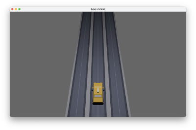

# bevy-runner - creating a 3D game with rust and bevy

My second 3D game with rust(https://www.rust-lang.org) and the bevy framework(https://bevyengine.org).

I am inspired by the classic endless runners like #TempleRun or #SonicDash but with cars.  
    
Thanks to Kenny https://www.kenney.nl for the assets.

## 1. Step _ load street and car

<br><br><br><br><br><br><br><br>


```Rust
//camera
    commands.spawn_bundle(PerspectiveCameraBundle{
        transform: Transform::from_xyz(1.0,6.0,3.0).looking_at(Vec3::new(1.,0.,-2.), Vec3::Y),
        ..Default::default()
    });

    // light
    commands.spawn_bundle(PointLightBundle{
        point_light: PointLight{
            intensity: 1500.0,
            shadows_enabled: true,
            ..Default::default()
        },
        transform: Transform::from_xyz(1.0, 4.0, 0.0),
        ..Default::default()
    });

    // street
    for j in -8..2 {
        for i in 0..3 {
            commands.spawn_bundle((
                Transform {
                    translation: Vec3::new(i as f32, 0.0, j as f32),
                    rotation: Quat::from_rotation_y(FRAC_PI_2),
                    ..Default::default()
                },
                GlobalTransform::identity(),
            ))
                .with_children(|parent| {
                    parent.spawn_scene(asset_server.load("models/road_straight.glb#Scene0"));
                });
        }
    }

    //player
    commands.spawn_bundle((
        Transform {
            translation: Vec3::new(1.0,0.0,0.0),
            scale: Vec3::new(0.4, 0.4, 0.4),
            ..Default::default()
        },
        GlobalTransform::identity(),
    ))
        .with_children(|parent| {
            parent.spawn_scene(asset_server.load("models/taxi.glb#Scene0"));
        })
        .insert(Player);
```
